# Take A Breath

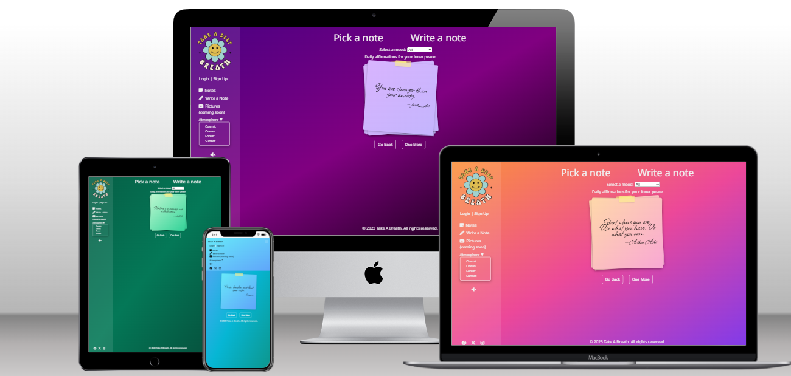

[Live Website](https://take-a-breath-a26c57655e5e.herokuapp.com/)  
[GitHub Repository](https://github.com/DaniqueJ-R/milestone_proj_3)

---

## About

Take A Breath is a minimalist, full-stack web application built to spread kindness and positivity online. Inspired by the concept of a message in a bottle, it allows users to submit short, anonymous motivational quotes or kind messages. When someone visits the site, they receive a randomly selected note written by another user. The project is designed with accessibility and user experience in mind, offering a calm and focused space where people can pause, reflect, and feel supported—no accounts or logins required. All messages are stored in a secure database and can be added or removed via a simple, user-friendly interface. Explore how each part of the site supports these goals in the following sections.

---

## Table of Contents

- [User Experience](#user-experience)
  - [Strategy](#strategy)
    - [Primary Strategic Aims](#primary-strategic-aims)
  - [Scope](#scope)
    - [In-Scope Features](#in-scope-features)
    - [Out-of-Scope Features](#out-of-scope-features)
    - [Scrapped Features](#scrapped-features)
  - [Structure](#structure)
  - [Skeleton](#skeleton)
    - [Wireframes](#wireframes)
    - [Data Model](#data-model)
    - [Site Map](#site-map)
  - [Surface](#surface)
    - [Visual Design](#visual-design)
    - [Color Scheme](#color-scheme)
    - [Typography](#typography)
    - [Media](#media)
- [Features](#features)
  - [Universal Features](#universal-features)
  - [Page-Specific Features](#page-specific-features)
- [Testing](#testing)
  - [Validator Testing](#validator-testing)
    - [HTML Validator](#w3c-html-validator)
    - [CSS Validator](#w3c-CSS-validator)
    - [JSHint](#jshint)
    - [Pep8 Online](#pep8-online)
  - [Browser Testing](#browser-testing)
  - [Manual Testing](#manual-testing)
    - [Functionality Testing](#functionality-testing)
    - [Responsiveness Testing](#responsiveness-testing)
    - [Accessibility Testing](#accessibility-testing)
    - [Data Management Testing](#data-management-testing)
    - [Error/Bug Testing](#errorbug-testing)
    - [Deployment Testing](#deployment-testing)
    - [Performance](#performance)
- [Bug Fixes/ General Improvements](#bug-fixes-general-improvements)
  - [Issues & Fixes](#issues--fixes)
  - [Remaining Bugs](#remaining-bugs)
  - [Future Improvements](#future-improvements)
- [Demo Account](#demo-account)
- [Deployment Guide](#deployment-guide)
  - [GitHub Pages Deployment](#1-github-pages-deployment-front-end)
  - [Heroku Deployment](#2-heroku-deployment-back-end)
    - [Database Setup](#database-setup)
    - [Configuring Environment Variables](#configuring-environment-variables)
    - [Django Settings Updates](#django-settings-update)
    - [Cloudinary Setup](#cloudinary-setup-media--static-files)
    - [Final Deployment](#final-deployment)
  - [Forking](#forking)
  - [Cloning Your Fork](#cloning-your-fork)
- [Credits](#credits)

---

## User Experience

### Strategy

This site is aimed at overall internet users seeking comforting and motivational quotes, and in turn would like to contribute to the positive pile of affirmations. The primary goals are to:

- Anyone is able to view notes at any time on the site
- atmosphere of site is changeable to allow for a more calming experience
- Logged in users are able to add, edit, and delete their own notes

**User Stories:**

- As a user, I want to be notified if my message contains harmful language and be prevented from submitting it, so the platform stays safe and positive.
- As a user, I want to log in so that I can edit and delete my own notes, ensuring I stay in control of my content.
- As a logged-in user, I want to be able to write and save a new note, so that I can express my thoughts and keep track of them.
- As a user, I want to click back and next buttons to flip through quotes so I can explore multiple uplifting messages at my own pace.
- As a user, I want to change the site’s theme to match calming environments (space, sea, forest, etc.) so I can choose the mood that helps me feel relaxed. 
- As a user, I want my quote to appear on a sticky note design so the messages feel personal, warm, and handwritten.
- As a user, I want the background white noise to match the theme I select, so the visuals and audio work together to create a relaxing atmosphere.
- As a user, I want new notes to stack on top of each other like real sticky notes, so the experience feels visually tactile and comforting.
- As a user, I want to include my name or have it show "Anonymous" if I leave it blank, so I can choose my level of visibility.
- As a user, I want to post a quote to a specific category whenever I want, so that I can share affirmations and organize them by mood.
- As a user, I want to filter messages by emotional categories like stress or grief, so I can read messages that match how I feel.
- As a user, I want to decorate my sticky note with cute stickers by dragging and dropping them, so I can add a personal, expressive touch.
- As a user, I want to like notes that resonate with me, so I can express appreciation and help highlight notes that others may also enjoy.

### Primary Strategic Aims

- A safe and supportive online space – Create a calm, minimalist environment where users can share and receive positive, anonymous notes without fear of negativity or harmful content.

- Increase engagement and return visits – Encourage users to keep interacting with the platform by offering a refreshing experience each time they visit, with new random motivational notes.

- Provide an alternative solution for wellbeing – Offer a simple, digital alternative to social media feeds by focusing solely on kindness and positivity, helping users pause, reflect, and boost their mood.

---

## Scope

### In-Scope Features

- Responsive homepage with eligable affirmations
- Navigation menu linking to all other main pages 
- interactive atmosphere changer with matching white noise
- Log in page with data protection
- Sign up page for new members
- CRUD for logged in users and their custom notes
- Note moderation for certain language
- Interactive interface for all screen size
- Social media integration

### Out-of-Scope Features

- Mood filter to seperate note types
- Report button under notes section
- About us Page with contact form
- Interacive stickers added to notes when written
- Like button for each note on homepage
- Pictures section to view photos of animals, relaxing sceens, etc

### Scrapped Features

- Users creating notes when not logged in

---

## Structure

- **Homepage:** Sticky Notes design, all approved quotes displayed, back and forth buttons, 'Pick a note' and 'Write a note' headers
- **Write Note Page:** Detailed explination how section works, Sticy Note design continued, reset and submit buttons, pop-up to inform if note auto or manually approved
- **My Notes Page:** all users notes, Pending and Approved sections, Edit and Delete Button for every note. 
- **Global Elements:** Consistent nav menu and sidebar menu for mobile and desktop respecivly, audio toggle, footer with licence, and social links


---
## Skeleton

### Wireframes

Wireframes were designed for mobile, tablet, and desktop responsiveness.

- Homepage Wireframes - 
[Desktop,](documents/read-me/desktop-1-homepage.png)
[Tablet,](documents/read-me/tablet-1-homepage.png)
[Phone](documents/read-me/phone-1-homepage.png)
- Writing Page Wireframes - 
[Desktop,](documents/read-me/desktop-2-writing.png)
[Tablet,](documents/read-me/tablet-2-writing.png)
[Phone](documents/read-me/phone-2-writing.png)
- My Notes Wireframes - 
[Desktop,](documents/read-me/desktop-3-dashboard.png)
[Tablet,](documents/read-me/tablet-3-dashboard.png)
[Phone](documents/read-me/phone-3-dashboard.png)

Responsive breakpoints considered:
- <576px - Phone
- ≥576px - Tablet and desktop


### Data Model

This project is hosted on Heroku and the database used is Heroku PostgreSQL. 
Two custom models were created for this project; Notes and Background. With the default Django User model already included. As seen in the below, these were made originally with the Stickers feature to be implimented, which was changed last minute due to time contraints. 

Entity Relationship Diagram - Notes:

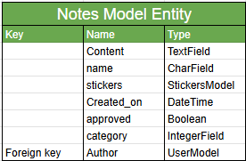

Entity Relationship Diagram - Background:

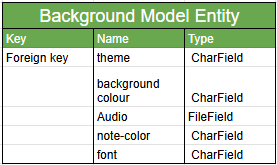

### Site Map

To explain the structure of the site and how to navigate it, I created a site map using Lucidchart:

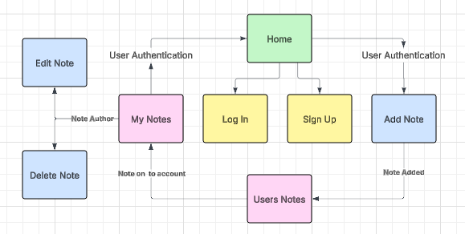

---
## Surface


### Visual Design

- Custom matching colourscheem for Sea (Blue Tones), Sunset(Orange-Purple Tones), Cosmic (purple Tones), and Forest(Green Tones) 
- Accessible typography for overall site
- Curved hadwritten typography for notes displayed
- Simple, welcoming layout

### Color Scheme

From the beginning, I wanted the site to feel dynamic and personal, so instead of being limited to a single color palette, I designed it to adapt based on the user’s chosen theme. Users can select between **Ocean, Sunset, Forest, or Space/Cosmic**, each with its own unique gradient background, note card styling, and button colors while keeping accessibility and readability in mind. These pallets were inspired by [Coolors](https://coolors.co/), and customized to prefered shades during the styling process.

To achieve this, I created theme-specific CSS classes (e.g., `.theme-sea`, `.theme-forest`, `.theme-sunset`, `.theme-space`) that apply consistent styling across the site’s elements, including the body background, note cards, and buttons. This ensures the design is cohesive within each theme while still providing variety and personalization.

Each theme was tested for **readability and accessibility**, with contrasting text colors against gradient backgrounds to ensure all notes remain easy to read for all visitors regardless of theme choice:

#### 🌌 Space / Cosmic - 

Deep indigos and purples with soft lavender notes.

* Background: `linear-gradient(indigo, purple, black)`
* Note cards: `#d8b4fe → #c4b5fd`
* Text color: `#3730a3`
* Buttons: `#a78bfa` (hover: `#7c3aed`)

#### 🌊 Ocean-

Bright turquoise and blues for a refreshing, calm aesthetic.

* Background: `linear-gradient(#60a5fa, #06b6d4, #0d9488)`
* Note cards: `#67e8f9 → #60a5fa`
* Text color: `#1e40af`
* Buttons: `#3b82f6` (hover: `#2563eb`)

#### 🌲 Forest -

Natural greens with dark accents for grounding and balance.

* Background: `linear-gradient(#065f46, #047857, #064e3b)`
* Note cards: `#bbf7d0 → #34d399`
* Text color: `#065f46`
* Buttons: `#10b981` (hover: `#059669`)

#### 🌅 Sunset - 

Warm oranges, pinks, and purples for an uplifting atmosphere.

* Background: `linear-gradient(#fb923c, #ec4899, #7c3aed)`
* Note cards: `#fed7aa → #f9a8d4`
* Text color: `#c2410c`
* Buttons: `#f97316` (hover: `#ea580c`)

### Typography

For the overall site, I selected **Noto Sans** as the primary font. This font was chosen for its clean, modern design and excellent readability across different devices. A serif fallback ensures that text remains legible even if the font fails to load.

To create a handwritten, personal touch for the notes, I used **Allison**. This script font brings warmth and authenticity to the design, with a sans-serif fallback for reliability.

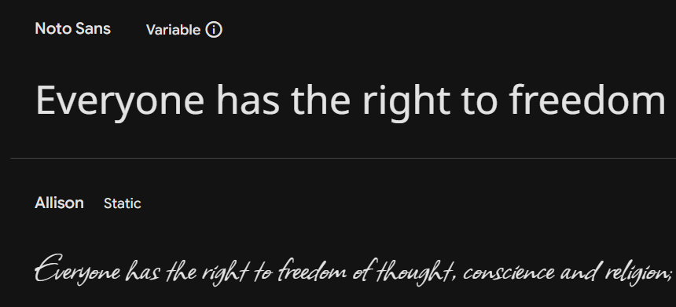

### Media

**Logo**

Since no logo was provided for this project, I explored free design resources to find one that fit the calming and uplifting theme of the site. After reviewing several options, I selected a completed logo from Creative Fabrica
, which aligned perfectly with the project’s minimalist aesthetic and focus on positivity.

The logo was chosen for its professional design quality and its ability to reflect the project’s purpose—creating a safe, welcoming space for users to pause, reflect, and share kindness. Its simple, modern style ensures accessibility and brand recognition across devices.

**Audio**

To enhance the calming and immersive experience of the site, I incorporated background sounds that change depending on the user’s chosen theme. After researching different options, I sourced four free, theme-fitting sounds from [Freesound](https://freesound.org/), ensuring they matched the moods of **Ocean, Sunset, Forest, and Space/Cosmic**.

Each sound was carefully selected to complement its theme—for example, soothing waves for the Ocean setting, gentle forest ambiance for Forest, and more atmospheric tones for Space. These audio choices help deepen the sense of mindfulness, allowing users to feel more connected to the environment they’ve chosen while exploring the site.

All audio elements are implemented in a way that respects accessibility, with the option to mute sounds if the user prefers a quieter experience.


**Accessibility Notes for Audio**

To ensure the audio features are inclusive, I considered users who may have hearing impairments or who prefer to browse without sound:

* Each audio track is paired with a clear descriptive label (e.g., *“Ocean waves”*, *“Forest birds”*, *“Space ambience”*, *“Sunset park ambience”*), so users understand what the sound represents.
* The site includes a **mute/unmute toggle button**, giving users full control over whether they want to engage with the audio.
* Audio is **optional and not required** to use or navigate the site, ensuring the experience is equally accessible to all users.
* Descriptions of the audio are included in the README and documentation, so users know what themes/sounds are available even if they cannot hear them.

This approach ensures that while sound enhances the mindfulness experience for many users, the platform remains fully functional and welcoming for everyone.

--- 

**Summery**
- All images and audio include alt tags
- Colour themes inspured by [Coolors](https://coolors.co/)
- Typography slected from [Google Font](https://fonts.google.com/)
- Audio embedded from source [Freesound](https://freesound.org/)
- Logo sourced from free platform [Creative Fabrica](https://www.creativefabrica.com/product/take-a-deep-breath-retro-svg/)

---

## Features

### Universal Features


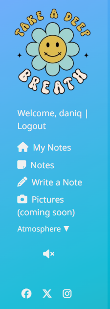
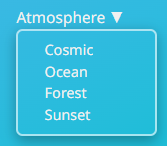

#### Navigation Menu 
Responsive nav bar for mobile and matching Sidebar for tablet and desktop. Contains the following:
- Site logo
- Log in / Sign up (if not logged in)
- My Notes (only if loogged in)
- Pick notes
- Write Notes
- Pictures (disabled)
- Atmosphere Changer
- Audio Toggle
- Social Media 


#### Footer
Contains copyright for site including year. 

#### Metadata
Optimized meta titles and descriptions for better SEO.

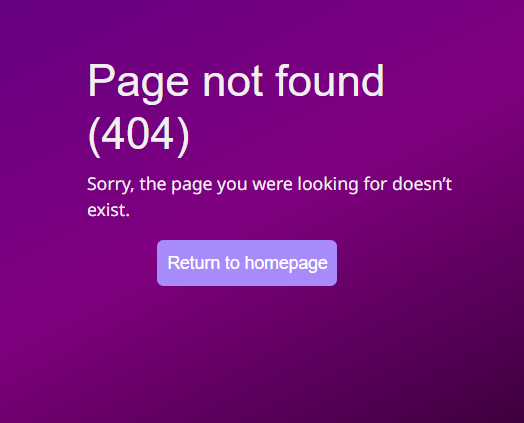

#### Error Pages
Errors 400, 403, 404, 405, and 500 added to fit theme of page if error occures

### Page-Specific Features

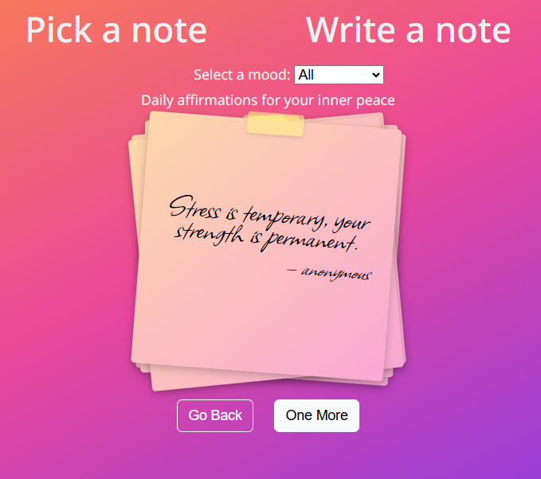

#### Sticky notes for display
displays handwritten notes from users in a stacked style of 5 background notes at a time. 

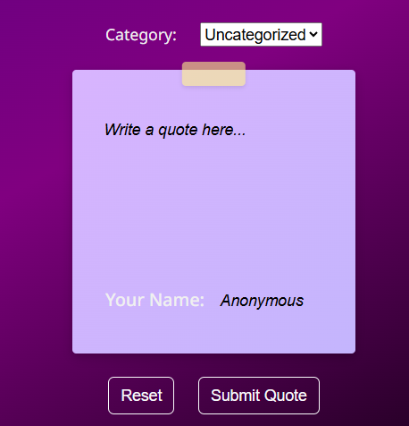

#### Write a note display
Continued stiky note design with the following: Notes area, name area (Anonymous by default) filter to manually approve notes with certain words

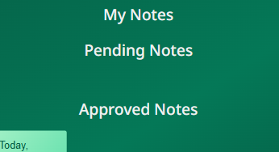
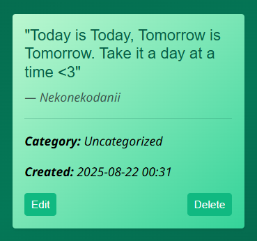

#### My notes display
Showcases all the users notes, seperated into Pending and Approved noted so user is easily infomred of their notes progress. Each note comes with a Delete and Edit button

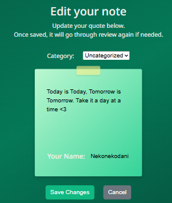

#### Edit a note display
Has same design as Write a note, with auto populated note for easy editing. Once Edited, change is seen immediatly. 

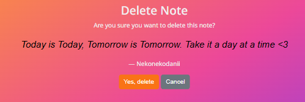

#### Delete a note display
Displays note and name without stikynote design. Once deleted, note is immediatly removed from rotation of displayable notes and database. 

---

## Testing

Throughout the Build phase, Chrome Developer Tools are used to ensure all pages are developed to remain intuitive, responsive, and accessible across all device widths. The pages were designed at 1400px wide, reducing to 320px for mobile devices. These tools and others were used for the Testing phase. 

 Chrome Developer Tools also used for debugging of Javascript file and pointing out possibe Django errors

The following sections summarise the tests and results.

### Validator Testing

#### W3C HTML Validator:

Code has been tested using the [HTML Validator](https://validator.w3.org/) and [CSS Validator](https://jigsaw.w3.org/css-validator/).

The W3C Markup Validator were used to validate the HTML on all pages of the project to ensure there were no syntax errors in there. To validate the HTML files, the html file from te browser was coppied for each page using the 'View Page Source' feature on Google Chome, to remove the Django Template and validate the whole page.

The Home Page gave errors during the verification only for the Select Mood dropdown, as it was read with the Django template even as a HTML file. 

* **Home page** - 36 Errors / 12 Warnings: 

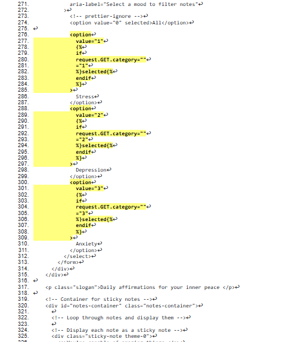

Index page - [View Full HTML Validation Results here.](https://github.com/DaniqueJ-R/milestone_proj_3/tree/main/documents/testing/home-html-checker-page.pdf)

* **Write a Note page** - 0 Errors / 0 Warnings:

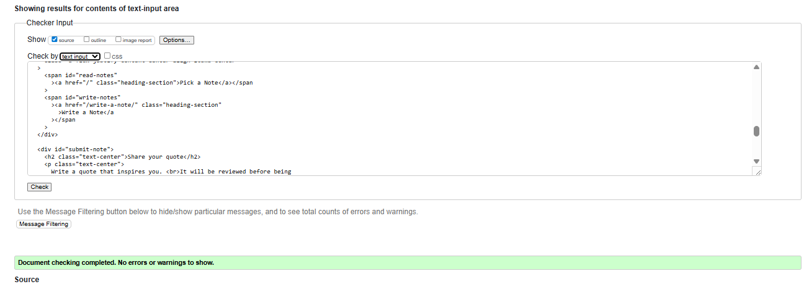

Write a Note page - [View Full HTML Validation Results here.](https://github.com/DaniqueJ-R/milestone_proj_3/tree/main/documents/testing/write-note-html-checker-page.pdf)

* **My Notes page** - 0 Errors / 0 Warnings:

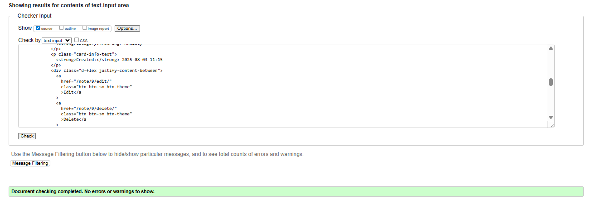

My Notes page - [View Full HTML Validation Results here.](https://github.com/DaniqueJ-R/milestone_proj_3/tree/main/documents/testing/my-note-html-checker-page.pdf)


#### W3C CSS Validator:

The W3C CSS Validator Services were used to validate the CSS giving the following results - 0 Errors / 5 warnings

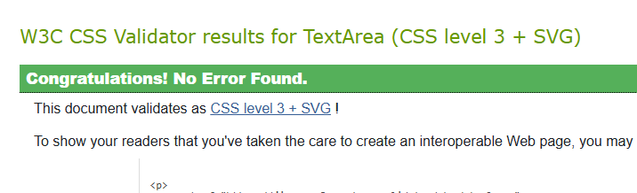

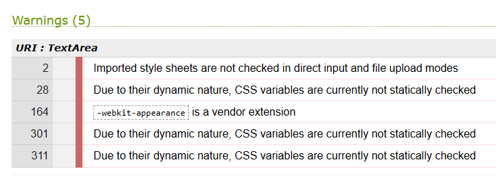

The warnings are due to 1) import of the Google fonts, 2) a webkit extension for Safari support of the flip-card effect used on the home page, and  3) using the root format for most colouring and text on the site (--var).


#### JSHint:

JSHint was used to validate the JavaScript with no errors highlighted.

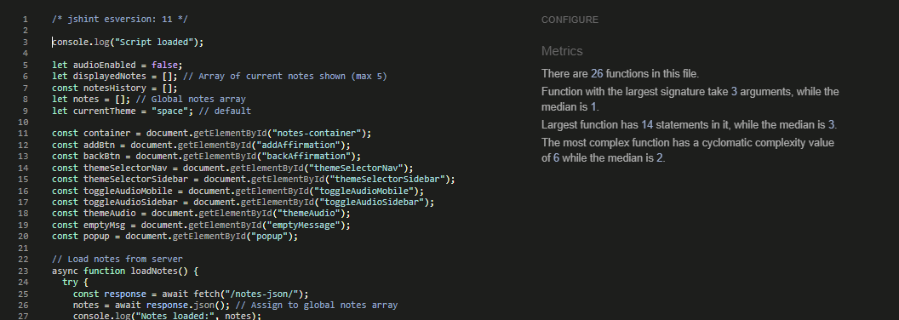

#### PEP8 Online:
 
PEP8 Online linter (Python validator) The code passed without any errors on all files tested:

  - admin.py

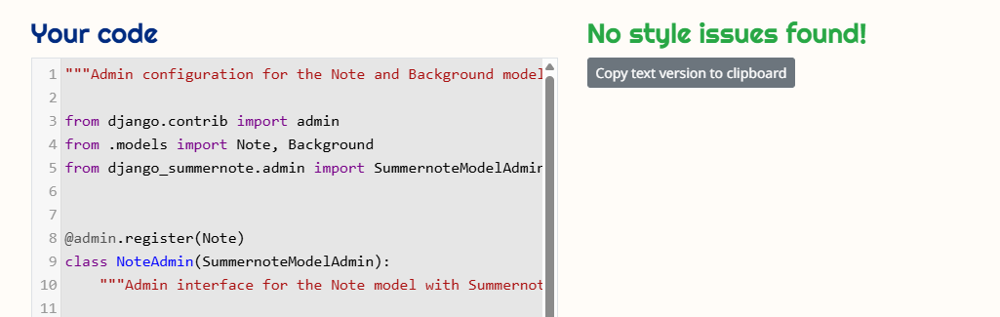

  - apps.py

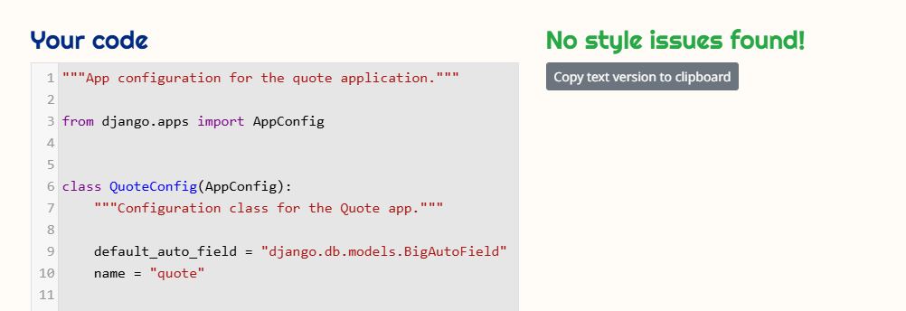

  - forms.py

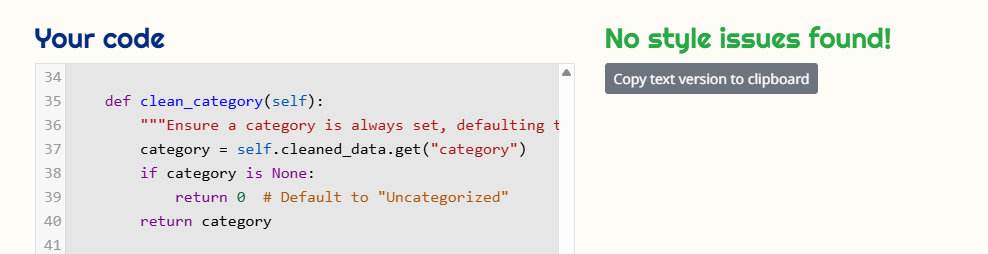

  - models.py

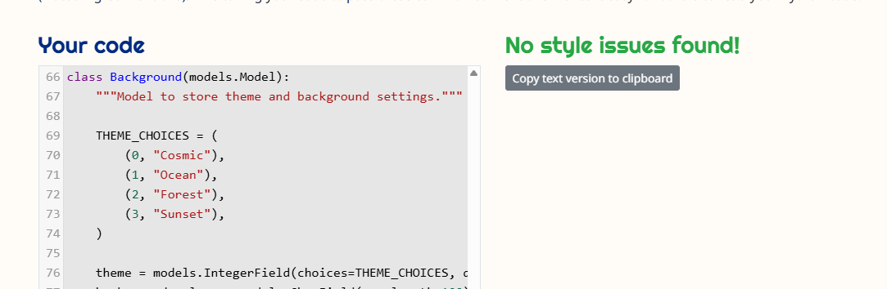

  - urls.py

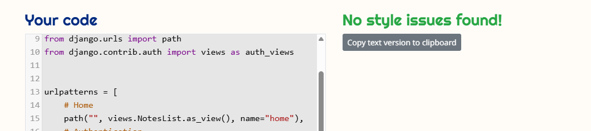

  - views.py

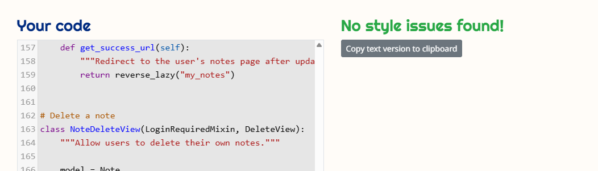


### Browser Testing

Tested across major browsers to ensure consistency:
- Navigation
- Fonts
- Note display
- Form functionality
- Responsiveness

I have tested that this application works using Macbook Air, and Asus Tuf, using the following browsers:

  - Safari 
  - Google Chrome 
  - Firefox 
  - Opera GX


### Manual Testing

#### Functionality Testing

I tested each feature of the site to ensure it works as intended.

| Feature | Action | Expected Result | Pass/Fail | Notes |
| ------- | ------ | --------------- | --------- | ----- |
| Home page loads | Visit `/` | Page loads with “Pick a Note” and “Write a Note” options, Sidebar with logo and links, and sticky note with text displayed automatically | ✅ Pass | Initial load shows all notes and default (space) background before updating to show correctly |
| Filter by mood | Select "Stress" in dropdown | Nothing changes on page | ❌ Fail | Did not have time to set up JS for filter |
| Log in | Entered different login details, both correct and incorrect | Pop-up informed what issue was denying my login, and once correct, took me to the home page with login template | ✅ Pass | No Notes |
| Add note | Submit note form with no name | Note approved with default name anonymous | ✅ Pass | Note shows under Approved Notes on My Notes page. Pop-up informed that the note was approved immediately |
| Add note with expletives | Submit note form with bad word from list | Pop up informed that note needs to be manually approved | ✅ Pass | Note shows under Pending Notes on My Notes page. Works with the new word added to the list immediately. |
| Edit note | Edit content of a pending and approved note | Updated content is saved and displayed immediately | ✅ Pass | Edit Page populated with note text already for easy alterations |
| Delete note  | Click “Delete” on a note | Note is removed from list | ✅ Pass | Delete Page shows full note and name to confirm deletion |
| Manually Approved notes  | Logged into Admin page and approves note manually | Note moves from “Pending” to “Approved” | ✅ Pass | User not notified of approval |
| Mobile navigation  | Open site on different phone types (IOS, Android) | Sidebar menu collapses to top screen Nav Bar and is usable | ⚠️ Partial | Navbar works, but does not collapse once theme selected or user taps outside nav bar |


---

### Responsiveness Testing

Tested the site across multiple screen sizes using Chrome DevTools, personal, and friends phones and laptops.

| Device             | Expected Behaviour                              | Pass/Fail |
| ------------------ | ----------------------------------------------- | --------- |
| Mobile (iPhone XR, Samsung S20, OnePlus Nord N 10) | Notes stack vertically, navigation collapses    | ✅ Pass    |
| Tablet (iPad)      | Notes display in grid, sidebar still accessible | ✅ Pass    |
| Desktop (1080p)    | Full layout visible, grid responsive            | ✅ Pass    |

---

### Accessibility Testing

Used [WAVE](https://wave.webaim.org/) and Lighthouse accessibility checker.

| Check               | Expected Result                             | Pass/Fail |
| ------------------- | ------------------------------------------- | --------- |
| Alt text on images  | All images have alt attributes              | ✅ Pass    |
| Contrast ratio      | Text has sufficient contrast                | ✅ Pass    |
| Keyboard navigation | All interactive elements accessible via Tab | ✅ Pass    |
| ARIA labels         | Sidebar navigation labelled                 | ✅ Pass    |

**Issues Resolved:**

- Resolved contrast issues and heading structure
- Transcript for Audio
- Missed and sort Aria lables and alts
- Connecting form to Mood selection Label

**Issues Not Resolved:**
- Atmosphere text, and buttons shows not to be in contrast with all backgounds, but no other test shown to give the same issue. 
- Notes detected to be headings which are incorrect so alert has been ignored. 
- Reminder to add transcript for audio as Alert. Transcript added but alert still shows.

---

### Data Management Testing

Checked CRUD functionality with database.

| Action               | Expected Result                               | Pass/Fail |
| -------------------- | --------------------------------------------- | --------- |
| Create note with expletives | Entry appears in DB with status `0` (Pending) | ✅ Pass    |
| Create note with **No** expletives | Entry appears in DB with status `1` (Approved) | ✅ Pass    |
| Approve note (admin) | Status changes to `1` (Approved)              | ✅ Pass    |
| Delete note          | Record removed from DB                        | ✅ Pass    |
| Delete User          | Record of user removed from DB but notes remain | ✅ Pass    |

---

### Error/Bug Testing

| Test                                 | Expected Result                                  | Outcome |
| ------------------------------------ | ------------------------------------------------ | ------- |
| Submit form with blank fields        | Form validation prevents submission              | ✅ Works |
| Access `/edit_note/` with invalid ID | Error handled gracefully (404)                   | ✅ Works |
| Delete note twice                    | First deletion works, second shows error message | ✅ Works |


### Deployment Testing

* Verified app deployed successfully on Heroku.
* Checked links in README – all work.
* Confirmed `DEBUG = False` in production.
* Confirmed no secrets (keys, passwords) in repo.


### Performance

Using Lighthouse performance testing within Chrome Developer Tools, every major page's performance was tested on desktop and mobile devices. The results from this testing are outlined below. 

**Lighthouse test - Mobile**

Lighthouse Home Mobile

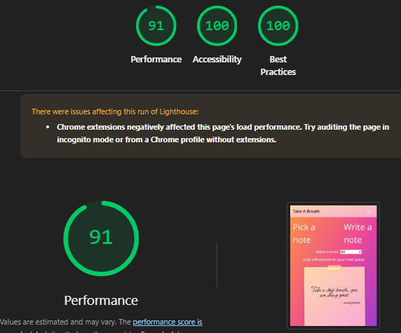

Lighthouse My Notes Mobile

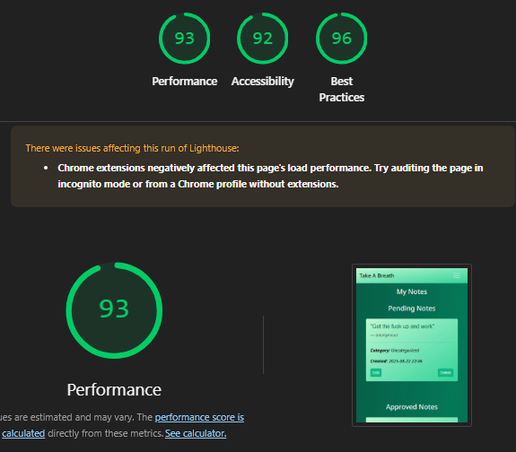

Lighthouse Write a Note Mobile

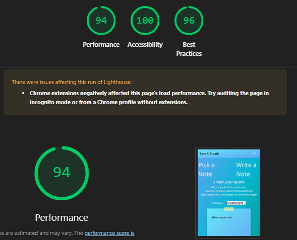

**Lighthouse test - Desktop**

Lighthouse Desktop

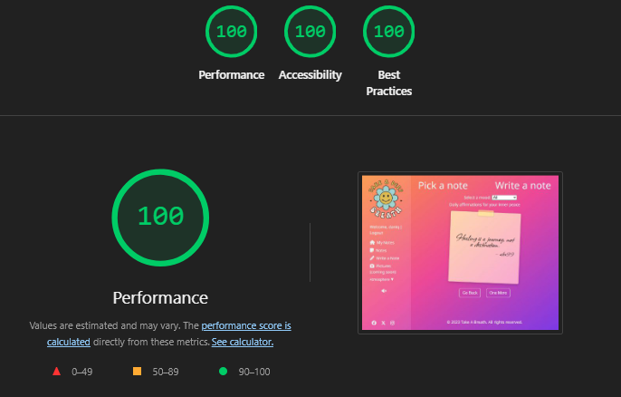

Lighthouse My Notes Desktop

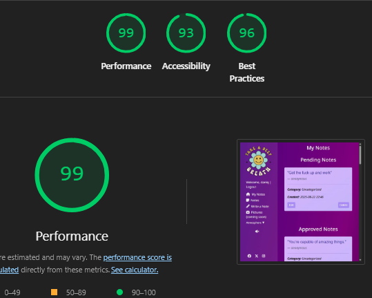

Lighthouse Write a Note Desktop

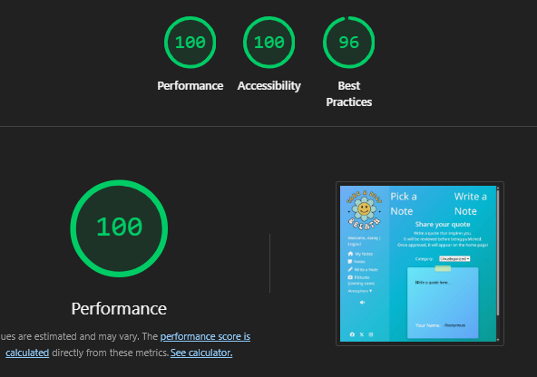

## Bug Fixes/ General Improvements 

### Issues & Fixes

* **Installing Gunicorn, Summernote, and Heroku** – Setting up deployment required configuring Gunicorn for production, adding Summernote for rich-text editing, and ensuring Heroku could serve static files.

- *Fix:* Adjusted Django settings, added missing requirements, and configured environment variables in Heroku.

* **Deployment Errors on Heroku** – The project wouldn’t deploy due to build errors and missing dependencies.

- *Fix:* Corrected the `Procfile`, updated `requirements.txt`, and re-ran `collectstatic` after adjusting debug settings.

* **Note Flip Function (JavaScript)** – Sticky notes weren’t flipping correctly, only partially animating.

- *Fix:* Rewrote the JS flip function and confirmed CSS transforms applied correctly.

* **Changing Note Colors with Background** – Notes and backgrounds weren’t updating together when the color was changed.

- *Fix:* Linked the color-change function to the flip event so both updated at the same time.

* **Sticky Notes Not Displaying** – Newly created notes weren’t showing on the sticky note board.

- *Fix:* Corrected backend template rendering to pass notes properly, then tested with new entries.

* **Database Rename Errors (Django)** – Model and field name changes broke the database.

- *Fix:* Wiped the database, applied fresh migrations, and reloaded test data.

* **Static Files Not Loading** – CSS/JS wasn’t being served correctly in Django.

- *Fix:* Updated `STATICFILES_DIRS` and `STATIC_ROOT`, deleted `staticfiles` and ran `collectstatic` again, then confirmed files loaded in production.

* **Login Redirect Error** – Login sent users to a missing template.

- *Fix:* Added `quote/login.html` to templates and updated URL mapping.

* **Sidebar vs Navbar on Mobile** – Sidebar took up space on small screens instead of collapsing.

- *Fix:* Overrode `display: flex` in the body using media queries and adjusted layout for responsive design.

* **Audio Playback Error** – Audio sometimes failed to play when changing themes.

- *Fix:* Updated JS to set the audio `src` before playback, which reduced errors.

* **Debug False & Static Files** – Turning off DEBUG caused static assets not to load.

- *Fix:* Cleared collected static files, set DEBUG to True temporarily, re-ran `collectstatic`, then redeployed.

* **Database information reset** – Once site was deployed again, all previouse users and note removed without a trace.  

- *Fix:* Reattached database correctly from Code Institute to Heroku and Github. 

* **Duplicate Accounts with Same Email** – Users could register multiple accounts with the same email. 

- *Fix:* Reattached database correctly 
---

### Remaining Bugs

* **Password Reset Page** – Currently shows success even if the email is not registered. Needs conditional check before showing confirmation.

* **Dropdown Filtering Issue** – Dropdown reloads the page and adds notes correctly, but filtering still does not work reliably.

* **Pending Notes Dashboard** – Does not display “No pending notes” when expected. Only shows if there are no Approved notes as well.

* **Mobile Theme Dropdown** – After selecting a theme, the nav doesn’t automatically close. Left as-is for now, but may be improved later.

* **Theme Change Blocked by Audio** – When music is playing, the theme selector does not appear. Requires JS adjustment to allow both at the same time.

* **Page Flicker on Theme Load** – Default theme - and all notes on homepage - briefly loads before switching to user’s saved theme and styling. Could be improved by applying the theme server-side on render.

---

### Future Improvements

* **User Authentication & Ownership** – Notes are now linked to logged-in users. Next step could be to add “liking” or “sharing” functionality for notes.

* **Language Translation** – Add `` and `` tags across templates so users can see messages in their preferred language.

* **Bad Word JSON System** – Currently updates manually. Could be extended to allow admins to add banned words directly via the dashboard.

* **Improved Navbar** – Consider refining mobile behavior so dropdowns collapse automatically without conflicting with theme or audio scripts.

* **Better Theme Loading** – Instead of client-side flicker, apply theme selection on the server during template rendering for a smoother user experience.

* **Audio Playback** – Look into having audio pause and play at same space instead of restarting. 

---

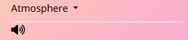

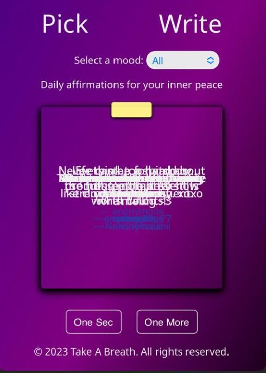

---
## Demo Account

You can explore the app on the deployed site using the following demo account:

- **Username:** testuser  
- **Password:** Test1234!

> **Note:** This is a temporary demo account for testing purposes only.  
> It does not have access to any real user data and may be reset periodically.

------

## Deployment Guide

This project was deployed using **GitHub Pages** for static hosting and **Heroku** for the Django backend.
Please do not make direct changes to the `main` branch, as any updates pushed there will automatically reflect on the live site.
Instead, fork and clone the repository if you wish to work on your own version without affecting production.


The live website can be found here: https://take-a-breath-a26c57655e5e.herokuapp.com/.

---

### 1. GitHub Pages Deployment (Front-End)

1. Log into the [GitHub repository](https://github.com/DaniqueJ-R/milestone_proj_3).
2. Click the **Settings** tab from the repository menu.
3. From the left-hand menu, click **Pages**.
4. Under **Source**, select the **Main branch** (instead of “None”) from the dropdown.
5. The page will automatically refresh, displaying the **deployment URL**.
6. Test the URL to confirm the site is live.

---

### 2. Heroku Deployment (Back-End)

1. Log into your [Heroku Dashboard](https://dashboard.heroku.com/apps).
2. Click **New → Create new app**.
3. Enter a unique app name and select your region.
4. Click **Create app**.

#### Database Setup

5. Go to the **Resources** tab.
6. In the **Add-ons** search bar, find **Heroku Postgres** and select it.
7. Choose the plan **Essential-0** and submit.

#### Configuring Environment Variables

8. Navigate to the **Settings** tab → **Reveal Config Vars**.
9. Copy the `DATABASE_URL` provided.
10. In your local project (GitPod or IDE), create a new `env.py` file in the top-level directory.
11. Inside `env.py`, add:

```python
import os
os.environ["DATABASE_URL"] = "Paste Heroku DATABASE_URL here"
os.environ["SECRET_KEY"] = "yourRandomSecretKey"
```

12. Back in Heroku, add the same `SECRET_KEY` in **Config Vars**.

#### Django Settings Update

13. In `settings.py`:

* Replace the hardcoded secret with:

  ```python
  SECRET_KEY = os.environ.get("SECRET_KEY")
  ```
* Update the database config:

  ```python
  DATABASES = {
      'default': dj_database_url.parse(os.environ.get("DATABASE_URL"))
  }
  ```

14. Save all files, then run migrations:

```bash
python manage.py migrate
```

#### Cloudinary Setup (Media & Static Files)

15. Log into [Cloudinary](https://cloudinary.com/) and copy the `CLOUDINARY_URL`.
16. In `env.py`:

```python
os.environ["CLOUDINARY_URL"] = "cloudinary://your-api-key"
```

17. Add the same variable to Heroku Config Vars.
18. Add this to `settings.py`:

```python
STATICFILES_STORAGE = "cloudinary_storage.storage.StaticHashedCloudinaryStorage"
STATICFILES_DIRS = [os.path.join(BASE_DIR, "static")]
STATIC_ROOT = os.path.join(BASE_DIR, "staticfiles")
MEDIA_URL = "/media/"
DEFAULT_FILE_STORAGE = "cloudinary_storage.storage.MediaCloudinaryStorage"
```

19. Ensure templates are linked properly:

```python
TEMPLATES_DIR = os.path.join(BASE_DIR, "templates")
TEMPLATES = [
    {
        "DIRS": [TEMPLATES_DIR],
    },
]
```

20. Add your app hostname to `ALLOWED_HOSTS`:

```python
ALLOWED_HOSTS = ["your-app-name.herokuapp.com", "localhost"]
```

#### Final Deployment

21. Create required folders at project root: `media/`, `static/`, `templates/`.
22. Create a `Procfile` with the following:

```
web: gunicorn PROJECT_NAME.wsgi
```

23. Push your code to GitHub.
24. In Heroku → **Deploy tab → Deploy Branch**.
25. When the build completes, click **Open App** to view the live site.

---


If you’d like to propose changes, contribute improvements, or use this project as the basis for your own, please fork and clone the repository instead of editing the main branch directly.

### Forking

1. Make sure you have [Git](https://git-scm.com/book/en/v2/Getting-Started-Installing-Git) installed and configured with authentication to GitHub.
2. Navigate to the [project repository](https://github.com/DaniqueJ-R/milestone_proj_3).
3. In the top-right corner of the repository page, click the **Fork** button (next to “Star” and “Watch”).
4. The repository will now appear in your GitHub account as your own fork.

### Cloning Your Fork

5. From your forked repository, click the green **Code** button above the file list.

6. Choose your preferred cloning option:

   * **HTTPS** — copy the URL and run:

     ```bash
     git clone https://github.com/your-username/milestone_proj_3.git
     ```
   * **SSH** — copy the SSH key and run:

     ```bash
     git clone git@github.com:your-username/milestone_proj_3.git
     ```
   * **GitHub CLI** — run:

     ```bash
     gh repo clone your-username/milestone_proj_3
     ```

7. Once cloned, navigate into the project folder:

   ```bash
   cd milestone_proj_3
   ```

8. You can now create your own branch, make changes, and push updates to your fork without affecting the live site.

🔗 For more details, see GitHub’s official guide: [Fork a Repo](https://docs.github.com/en/get-started/quickstart/fork-a-repo).


## Credits

### People

* Mentor Brian Macharia for guiding and advising throughout the project's lifecycle.
* Rick Atherton, Elaine Broche, mittnamnkenny, and Ilyascan OIgun are sources of information for README content and layout.
* Code Institute Slack community for peer reviewing the website.

### Languages Used:

  - HTML5
  - CSS3
  - Bootstrap
  - JavaScript
  - Python 
  - Django
  - Chrome DevTools
  - Git
  - GitHub

### Frameworks and Libraries Used:

  - [Bootstrap:](https://getbootstrap.com/) Bootstrap CSS Framework used for styling and to build responsive web pages.
  - [Coverage:](https://coverage.readthedocs.io/en/latest/index.html) Used for measuring code coverage of Python test files. 
  - [Django:](https://www.djangoproject.com/) Main Python framework used in the development.
  - [Django Crispy Forms:](https://django-crispy-forms.readthedocs.io/en/latest/) Used to simplify the rendering of Django forms.
  - [dj_database_url:](https://pypi.org/project/dj-database-url/) Used to allow database urls to connect to the postgres database.
  - [Gunicorn:](https://gunicorn.org/) Green Unicorn, used as the Web Server to run Django on Heroku.
  - [psycopg2:](https://pypi.org/project/psycopg2/) Used PostgreSQL database adapter. 
  - [Summernote:](https://github.com/summernote/django-summernote) To provide a WYSIWYG editor for customizing new blog content and add images.
  - [Black Formatter:](https://www.youtube.com/watch?v=nrQly6jybNk&t=466s) To format Django and Python documents in VSCode

### Software and Web Applications Used:

  - [Am I Responsive:](http://ami.responsivedesign.is) Checking the responsive.
  - [Wireframe CC:](https://wireframe.cc/) Used to create the wireframes.
  - [Chrome DevTools:](https://developer.chrome.com/docs/devtools/) Used to test the response on different screen sizes, debugging and to generate a Lighthouse report to analyze page load.
  - [Font Awesome:](https://fontawesome.com/) Used throughout the site to add icons for aesthetic and UX purposes.
  - [Creative Fabrica](https://www.creativefabrica.com/product/take-a-deep-breath-retro-svg/) Site that provided Logo for Take A Breath
  - [Favicon.io:](https://favicon.io/) To format Logo to use as favicon.
  - [Git:](https://git-scm.com/) Git was used for version control by utilizing the Gitpod terminal to commit to Git and Push to GitHub.
  - [GitHub:](https://github.com/) GitHub is used to store the projects code after being pushed from Git and to create the Kanban board used for this project.
  - [Google Fonts:](https://fonts.google.com/) To import font family ’Cabin Sketch’ which is used throughout the site. Added fallback font sans-serif.
  - [Heroku:](https://www.heroku.com/) For deployment and hosting of the application.
  - [Heroku PostgreSQL:](https://www.heroku.com/postgres) The database used for this application.
  - [HTML Validator:](https://validator.w3.org/) Check your code for HTML validation.
  - [JSHint:](https://jshint.com/) Check code for JavaScript validation.
  - [Lucidchart:](https://www.lucidchart.com/pages/) Used to create the site map.
  - [Coolors:](https://coolors.co/) Used to create the main colour palette. 
  - [Freesound:](https://freesound.org/) Used to source audio files. 
  - [W3 CSS Validator:](https://jigsaw.w3.org/css-validator/) Check your code for CSS validation.
  - [Codewof:](https://www.codewof.co.nz/style/python3/) Check your code for Pep8/Python validation.
  - [Grammarly:](https://www.grammarly.com/) Free Grammar Check.
  - [FireShot chrome extension](https://chromewebstore.google.com/detail/take-webpage-screenshots/mcbpblocgmgfnpjjppndjkmgjaogfceg) To get PDF of HTML Errors
